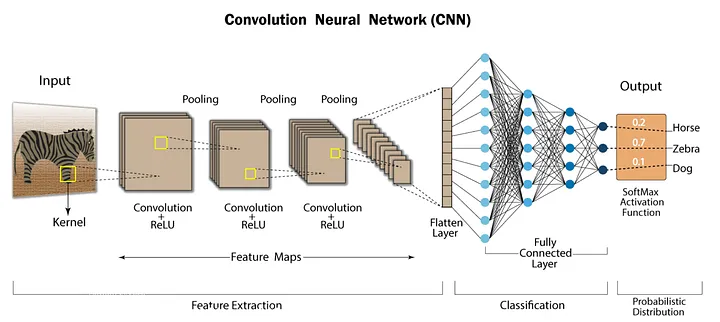
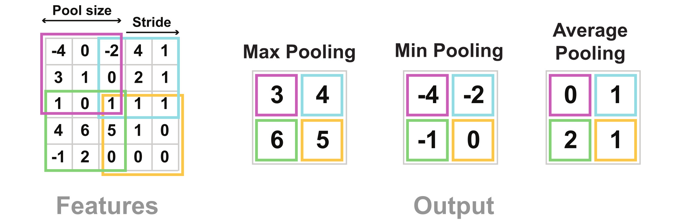

# Computer Vision

## Convolutional Neural Network (CNN)
- When feeding images into a neural network, we convert the pixel values into a tensor of size $(\text{width} \times \text{height} \times 3)$, with 3 channels for each of the RGB colors.
- With images, we can take advantage of two **priors**:
    - **Locality**: Nearby areas tent to contain strong patterns
        - Ex. If we look at a small subsection of an image, we might be able to identify a line. Expand this subimage, and we might be able to identify multiple lines that makes a shape.
    - **Translation Invariance**: Only relative positions are relevant.
        - Ex. The position of an object in an image doesn't matter. We can still recognize the object.

- CNNs use a sliding window of weights called a **kernel** and move it around the image. The same set of weights are used to inspect different sections of the image.
    - **Stride** is when we skip a certain number of pixels when moving the window (instead of just sliding 1 pixel). Higher stride = smaller feature map.
    - **Padding** pizels may be used when the kernel size and stride don't align.
- Multiple kernels are learned, and when you take the dot product of the kernel and a subsection of the image, it produces an **feature/activation map**, which can be thought of as how much that subsection corresponds to the feature learned by that kernel.

- Pooling reduces the dimensions of feature maps via mean or maximum operations.
- Once we perform the heirarchal feature extraction (line $\rightarrow$ shape $\rightarrow$ box) via multiple convolutional layers, we can feed it into our normal fully connected layers for regression or classification tasks.